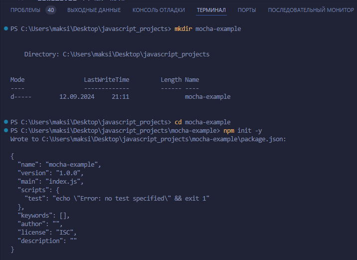
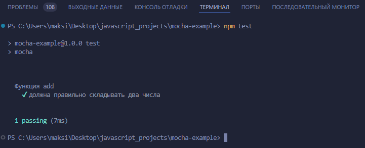

# Тестирование кода на Mocha

Пример тестового проекта на Mocha, который будет тестировать функцию сложения, аналогично предыдущему примеру с Jest.


### Шаг 1: Создание проекта

**Инициализируйте проект npm:**

**Откройте терминал и выполните следующие команды:**

```bash
mkdir mocha-example
cd mocha-example
npm init -y
```



**Установите `Mocha` и `Chai` (для ассертов):**

**Mocha** — это тестовый фреймворк, а **Chai** — библиотека для утверждений (assertions).

```bash
npm install --save-dev mocha chai
```

**Добавьте скрипт для запуска тестов в `package.json`:**

**Откройте файл `package.json` и добавьте следующую строку в секцию "scripts":**

```json
{
  "name": "mocha-example",
  "version": "1.0.0",
  "type": "module",
  "main": "index.js",
  "scripts": {
    "test": "mocha"
  },
  "devDependencies": {
    "chai": "^4.3.6",
    "mocha": "^10.0.0"
  }
}
```

### Шаг 2: Создайте тестируемую функцию

**Создайте файл с функцией `add.js`:**

**В корневом каталоге проекта создайте файл `add.js` и добавьте в него следующую функцию:**

```js
// add.js
export default function add(a, b) {
  return a + b;
}

```

**Создайте папку `test` и файл с тестами `add.test.js`:**

**В корневом каталоге создайте папку `test` и файл `add.test.js` внутри этой папки, добавив следующие тесты:**

```js
// test/add.test.js
import { expect } from 'chai';
import add from '../add.js';

describe('Функция add', function() {
  it('должна правильно складывать два числа', function() {
    expect(add(1, 2)).to.equal(3);
    expect(add(-1, -1)).to.equal(-2);
    expect(add(0, 0)).to.equal(0);
    expect(add(1, -1)).to.equal(0);
  });
});
```

### Шаг 3: Запустите тесты

**Теперь вы можете запустить тесты с помощью команды:**

```bash
npm test
```

`Mocha` выполнит тесты, и результат будет отображен в терминале.



### Шаг 4: Расширение

Вы можете продолжить расширять проект, добавляя больше тестов для других функций или сценариев.

Mocha отлично работает для асинхронных тестов, если в будущем вам понадобится тестировать такие случаи.

### Структура проекта

**В итоге ваш проект будет выглядеть следующим образом:**

```
mocha-example/
│
├── node_modules/          # Зависимости
├── add.js                 # Тестируемая функция
├── package.json           # Файл конфигурации npm
└── test/
    └── add.test.js        # Тесты для функции сложения
```

Теперь у вас есть тестовый проект на Mocha, готовый к использованию.

**Преподаватель:** Дуплей Максим Игоревич

**Дата:** 12.09.2024

**Версия 1.0**
